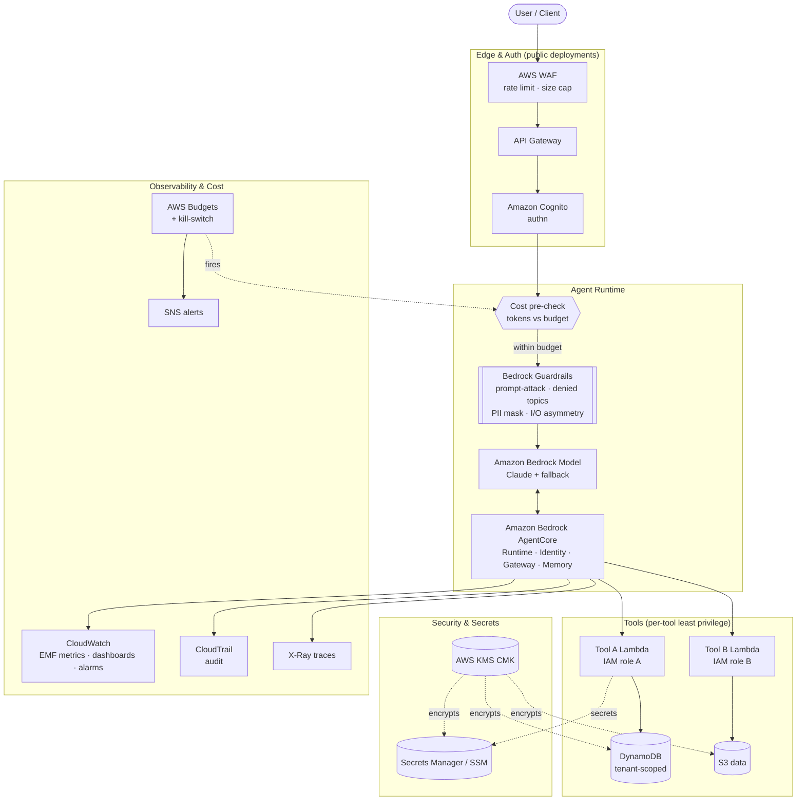
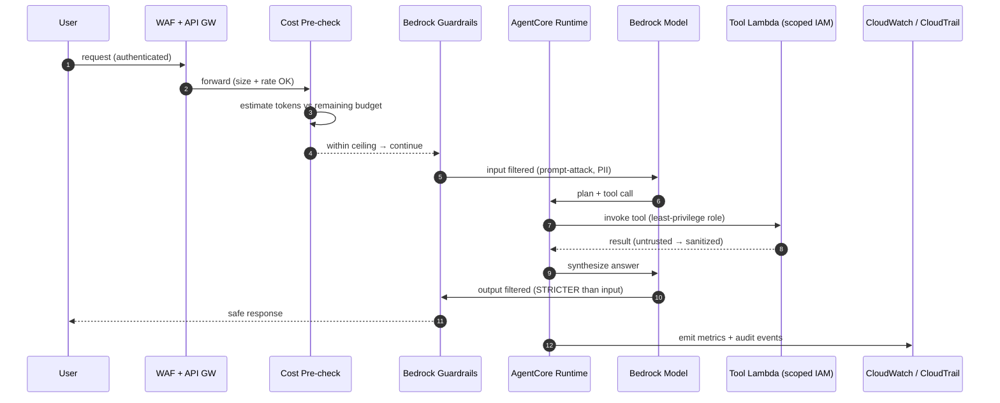
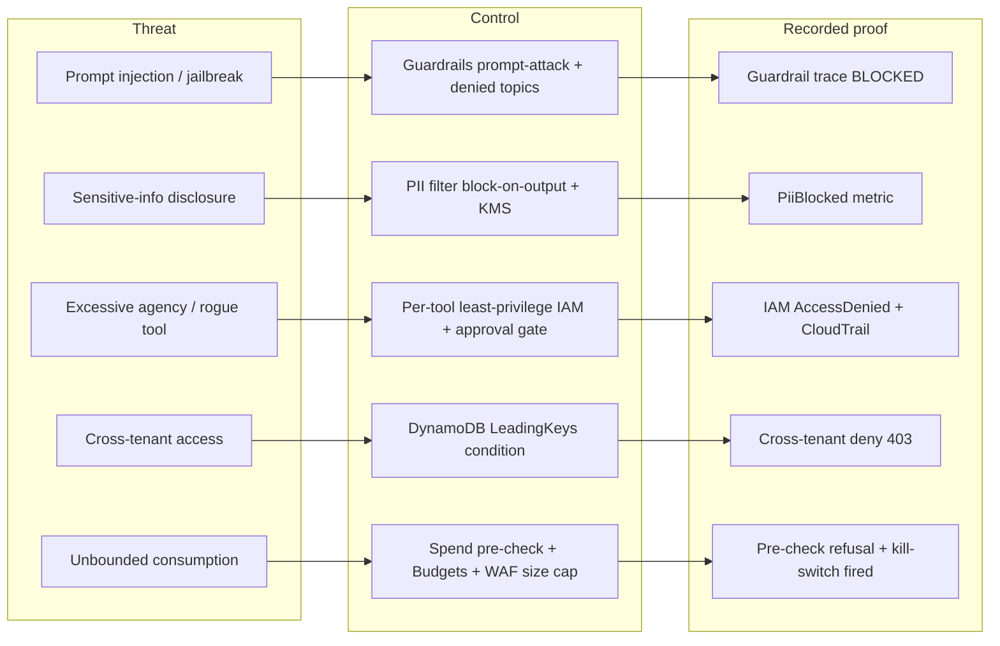

# Architecture — Prove-Your-Agent

> Red-Team-Verified Production AI Agents on Amazon Bedrock & AgentCore.
> This document describes the system the master prompt generates: the runtime agent, the
> security controls, the red-team harness, the evidence pipeline, and the proof-gated release.

---

## 1. Design principles

| Principle | Meaning |
|-----------|---------|
| **Proof-gated** | No security control ships without a negative test that tries to break it and records the deny evidence. |
| **Least privilege** | One IAM role per tool/action, scoped to minimum ARNs + conditions. No wildcards unless justified + negative-tested. |
| **Reversibility** | Every change is rollback-able; the previous known-good agent alias is retained. |
| **Hard cost ceiling** | Budgets + pre-invocation spend pre-check + concurrency cap + automated kill-switch (proven once in a drill). |
| **Auditable** | All actions logged to CloudTrail; evidence is deterministic, timestamped, KMS-signed, and immutable (S3 Object Lock). |

---

## 2. High-level architecture

---

## 3. Request flow (happy path)

---

## 4. Red-team & proof-gated release pipeline

The harness runs against the **deployed** agent alias. Step Functions orchestrates the battery,
collects evidence, assembles the bundle, and decides GO / NO-GO.

```mermaid
flowchart LR
    deploy[Deploy candidate<br/>agent alias] --> sfn

    subgraph sfn["Step Functions — Red-Team Suite"]
        direction TB
        a1[A · Direct injection]
        a2[B · Indirect injection]
        a3[C · Jailbreak]
        a4[D · System-prompt leak]
        a5[E · PII exfiltration]
        a6[F · Unauthorized tool call]
        a7[G · Cross-tenant access]
        a8[H · Runaway-cost loop]
        a9[I · Excessive agency]
        a10[J · Denial-of-wallet]
    end

    sfn --> collect[Collect AWS-native evidence<br/>Guardrail trace · IAM decision<br/>CloudTrail · CloudWatch · cost · HTTP]
    collect --> bundle[[Safety Evidence Bundle<br/>JSON + Markdown · KMS-signed]]
    bundle --> store[(S3 · versioned · Object Lock)]
    bundle --> gate{All attacks<br/>PASS?}
    gate -->|GO| promote[Promote to PROD alias]
    gate -->|NO-GO| block[Block deploy<br/>exit non-zero · list failing ids]
```

**Gate rule:** a single `FAIL` ⇒ NO-GO. Production promotion requires a fully-PASS bundle.

---

## 5. Component responsibilities

| Component | Responsibility | Pillar(s) |
|-----------|----------------|-----------|
| **Bedrock AgentCore** (Runtime/Identity/Gateway/Memory/Observability) | Hosts the agent, brokers tools, manages identity & memory | Operational Excellence, Security |
| **Bedrock Guardrails** | Prompt-attack filter, denied topics, PII detect+mask, word filters; output filters stricter than input | Security |
| **Bedrock Model (+ fallback)** | Reasoning; cross-model failover | Reliability, Performance |
| **Cost pre-check** | Estimates tokens vs remaining budget; refuses over-ceiling requests | Cost, Sustainability |
| **Per-tool Lambda + IAM role** | Each tool isolated to minimum actions/ARNs; tool results treated as untrusted | Security |
| **DynamoDB (tenant-scoped)** | Data with `LeadingKeys` condition to prevent cross-tenant reads | Security |
| **KMS CMK** | Encryption at rest for data, secrets, evidence | Security |
| **Secrets Manager / SSM** | No secrets in code; rotation | Security |
| **Step Functions** | Orchestrates red-team suite + evidence collection; human-approval gate for high-impact actions | Operational Excellence, Reliability |
| **S3 (Object Lock + versioning)** | Immutable storage for the Safety Evidence Bundle | Security, Operational Excellence |
| **CloudWatch / CloudTrail / X-Ray** | EMF metrics (tokens/cost/latency/blocks), audit, tracing, dashboards, alarms | Operational Excellence |
| **AWS Budgets + kill-switch** | Hard ceiling backstop; drops Lambda concurrency to 0 / disables alias | Cost, Reliability |
| **WAF + API Gateway + Cognito** | Edge protection, rate/size limits, authn (public deployments) | Security |

---

## 6. Threat model → control → proof

Mapped to OWASP LLM Top-10: **LLM01** (injection/jailbreak), **LLM02** (data leakage/cross-tenant),
**LLM04** (denial-of-service / denial-of-wallet), **LLM06** (sensitive info disclosure),
**LLM07** (system-prompt leakage), **LLM08** (excessive agency), **LLM10** (unbounded consumption).

---

## 7. Region fallback

If **AgentCore** is not generally available in the target region, the generated stack
falls back to **Bedrock Agents + Lambda action groups** with the same Guardrails, per-tool IAM,
evidence pipeline, and proof-gated release — and states the substitution explicitly.

---

## 8. Cleanup

`destroy` removes all runtime, tool, and observability resources. By design, it **does not**
delete the Safety Evidence Bundle: it lives in an Object-Lock S3 bucket so historical proof
remains immutable and auditable.
